# AI 레드팀 도구 — ERD (데이터 모델 확정) · 11개 테이블

> ## ⚠️ 이 문서는 **옛 버전(초안)** 입니다 — 최신 정합본은 [ERD-완전정리.md](./ERD-완전정리.md)
> 팀이 ERD를 편집하면서 아래가 **바뀌었으니 이 문서 대신 최신본을 보세요**:
> - `recon_profiles` 테이블 **삭제 → `target_projects`(옛 `targets`)에 통합** (테이블 11 → 10개)
> - `ownership_verified`/`verify_method`/`verify_token` **컬럼 삭제** (GitHub 로그인으로 갈음)
> - `avatar_url` **삭제**, `attempts.seed_case_id` → **`attack_id`**, `name` → **`project_name`**
> - PK가 테이블별 접두 방식(`user_id`/`target_id`/`scan_id`...)
>
> 아래 내용은 히스토리 참고용으로만 남겨둠.

> `기획.md §8·§9` 를 기준으로 확정한 데이터 모델. 백엔드 SQLAlchemy 모델(`app/backend/app/models.py`)과 **컬럼명·타입이 1:1로 일치**한다.
> - **PoC 런타임**: SQLite. `embedding`은 JSON(float 배열) 문자열로, 검색은 메타필터 + (옵션) 코사인 브루트포스.
> - **프로덕션**: PostgreSQL + pgvector. `embedding vector(384)` + HNSW 인덱스.
> - **공통 감사 컬럼(TimestampMixin)**: 모든 11개 테이블에 `created_at`(생성일시)·`updated_at`(수정일시)·`deleted_at`(삭제일시, soft-delete) 포함.
> - **컬럼 명명**: ERDCloud/DDL은 **앞=한글 논리명(COMMENT), 뒤=영어 물리명**. import 파일은 §5.

**테이블 11개**: `users`(사용자) · `targets`(공격대상) · `atlas_techniques`(ATLAS기법마스터) · `scans`(스캔) · `recon_profiles`(정찰프로파일) · `objectives`(공격목표) · `attempts`(공격시도) · `findings`(발견취약점) · `attack_cases`(공격코퍼스) · `scan_events`(스캔이벤트로그) · `scan_reports`(스캔통계리포트)

---

## 1. 개요 다이어그램

```mermaid
erDiagram
    User        ||--o{ Target   : owns
    Target      ||--o{ Scan     : "scanned by"
    Scan        ||--o{ Objective: "has"
    Objective   ||--o{ Attempt  : "produces"
    Attempt     ||--o| Attempt  : "parent (evolution)"
    AttackCase  ||--o{ Attempt  : "seeds"
    Scan        ||--o{ Finding  : "reports"
    Objective   ||--o{ Finding  : "for"
    Attempt     ||--o| Finding  : "evidence"

    User {
        int      id PK
        string   github_id UK
        string   github_login
        string   name
        string   avatar_url
        string   access_token_enc
        datetime created_at
    }
    Target {
        int      id PK
        int      user_id FK
        string   name
        string   actor_type
        json     config
        string   model_hint
        string   purpose
        text     system_prompt
        string   repo_url
        bool     ownership_verified
        string   verify_method
        string   verify_token
        datetime created_at
    }
    Scan {
        int      id PK
        int      target_id FK
        string   status
        json     config
        json     progress
        datetime started_at
        datetime finished_at
        datetime created_at
    }
    Objective {
        int      id PK
        int      scan_id FK
        string   atlas_technique_id
        string   name
        string   category
        string   status
        float    best_score
        string   stop_reason
        datetime created_at
    }
    Attempt {
        int      id PK
        int      objective_id FK
        int      parent_attempt_id FK
        int      seed_case_id FK
        int      generation
        text     prompt_text
        text     response_text
        float    score
        string   verdict
        json     judge_detail
        string   mutation_op
        text     improvement
        datetime created_at
    }
    Finding {
        int      id PK
        int      scan_id FK
        int      objective_id FK
        int      attempt_id FK
        string   atlas_technique_id
        string   severity
        string   title
        json     evidence
        text     mitigation
        datetime created_at
    }
    AttackCase {
        int      id PK
        text     prompt_text
        string   attack_type
        string   atlas_technique_id
        string   source
        json     worked_on
        bool     verified
        json     tags
        text     embedding
        datetime created_at
    }
```



---

## 2. 테이블 상세

### 2.1 `users` — 로그인 사용자 (GitHub OAuth)
| 컬럼 | 타입 | 제약 | 설명 |
|---|---|---|---|
| id | int | PK | |
| github_id | string | UNIQUE, NOT NULL | GitHub 계정 고유 id (sub) |
| github_login | string | NOT NULL | GitHub username |
| name | string | | 표시 이름 |
| avatar_url | string | | 프로필 이미지 |
| access_token_enc | string | | GitHub access token (암호화 저장, 리포 분석용) |
| created_at | datetime | default now | |

### 2.2 `targets` — 공격 대상 앱 (자기 소유)
| 컬럼 | 타입 | 제약 | 설명 |
|---|---|---|---|
| id | int | PK | |
| user_id | int | FK→users.id, NOT NULL | 소유자 |
| name | string | NOT NULL | 대상 표시 이름 |
| actor_type | string | NOT NULL, default `http` | `http` \| `browser` |
| config | json | NOT NULL | 액터 설정. http: `{url, method, headers, body_template, response_path, delay, max_retries}` / browser: `{url, input_selector, submit_selector, output_selector}` |
| model_hint | string | | 정찰로 파악한 모델(예: gpt-4o) |
| purpose | string | | 앱 용도(예: 고객지원 챗봇) |
| system_prompt | text | nullable | 알고 있으면 입력(유출 판정 정확도↑) |
| repo_url | string | nullable | 화이트박스 리포 분석용 GitHub 주소 |
| ownership_verified | bool | default false | 소유/권한 확인 통과 여부 |
| verify_method | string | | `dns_txt` \| `meta_tag` \| `repo_file` \| `manual` |
| verify_token | string | | 소유 확인용 랜덤 토큰 |
| created_at | datetime | default now | |

> ⚠️ 인가 원칙(기획 §5.1): 리포 열람 권한과 엔드포인트 공격 권한은 별개 → `ownership_verified=true` 인 대상만 스캔 허용. PoC는 자체 더미앱만 대상.

### 2.3 `scans` — 스캔 실행 1건
| 컬럼 | 타입 | 제약 | 설명 |
|---|---|---|---|
| id | int | PK | |
| target_id | int | FK→targets.id, NOT NULL | |
| status | string | NOT NULL, default `pending` | `pending` \| `running` \| `done` \| `failed` |
| config | json | | `{max_generations, population_size, objectives:[atlas_id...], model}` |
| progress | json | | 실시간 진행 스냅샷 `{generation, evaluated, best_score, phase}` |
| started_at | datetime | nullable | |
| finished_at | datetime | nullable | |
| created_at | datetime | default now | |

### 2.4 `objectives` — 공격 목표(앱 1개를 여러 각도로)
| 컬럼 | 타입 | 제약 | 설명 |
|---|---|---|---|
| id | int | PK | |
| scan_id | int | FK→scans.id, NOT NULL | |
| atlas_technique_id | string | | 예: `AML.T0051.000` |
| name | string | | 예: Direct Prompt Injection |
| category | string | | prompt_injection \| jailbreak \| data_leakage \| pii |
| status | string | default `pending` | `pending` \| `running` \| `breached` \| `safe` \| `exhausted` |
| best_score | float | default 0 | 최고 fitness |
| stop_reason | string | | success \| budget \| stagnation \| extinct \| timeout |
| created_at | datetime | default now | |

### 2.5 `attempts` — 개별 공격 시도(= 진화 계보 노드) ★핵심
| 컬럼 | 타입 | 제약 | 설명 |
|---|---|---|---|
| id | int | PK | |
| objective_id | int | FK→objectives.id, NOT NULL | |
| parent_attempt_id | int | FK→attempts.id (self), nullable | **진화 계보** — 진화 트리 시각화 |
| seed_case_id | int | FK→attack_cases.id, nullable | "실제 데이터 기반" 추적 |
| generation | int | NOT NULL, default 0 | 세대(0=씨앗) |
| prompt_text | text | NOT NULL | 발사한 공격 프롬프트 |
| response_text | text | | 대상 응답 |
| score | float | default 0 | fitness(판정 점수) |
| verdict | string | | `breach` \| `safe` \| `error` |
| judge_detail | json | | `{stage, rule, canary_hit, refusal, guard_score}` |
| mutation_op | string | | none \| generate_similar \| crossover \| expand \| shorten \| rephrase \| encode |
| improvement | text | | LLM 변이 시 "왜 이렇게 바꿨는지"(대시보드 AI 추론과정) |
| created_at | datetime | default now | |

### 2.6 `findings` — 확정된 취약점(뚫림)
| 컬럼 | 타입 | 제약 | 설명 |
|---|---|---|---|
| id | int | PK | |
| scan_id | int | FK→scans.id, NOT NULL | |
| objective_id | int | FK→objectives.id | |
| attempt_id | int | FK→attempts.id | 성공한 시도(증거) |
| atlas_technique_id | string | | 히트맵 매핑 |
| severity | string | | low \| medium \| high \| critical |
| title | string | | |
| evidence | json | | `{prompt, response, canary}` |
| mitigation | text | | 완화책 |
| created_at | datetime | default now | |

### 2.7 `attack_cases` — 공격 코퍼스(씨앗 도서관)
| 컬럼 | 타입 | 제약 | 설명 |
|---|---|---|---|
| id | int | PK | |
| prompt_text | text | NOT NULL | 공격 프롬프트 원문 |
| attack_type | string | | prompt_injection \| jailbreak \| data_leakage \| pii |
| atlas_technique_id | string | | **authoring-time 라벨**(정적) |
| source | string | | jailbreak_llms \| L1B3RT4S \| hackaprompt \| spml |
| worked_on | json | | 성공했던 모델 배열 `["gpt-4o"]` |
| verified | bool | default false | 자체 더미앱 재검증 통과 |
| tags | json | | 자유 태그 |
| embedding | text/vector | | PoC: JSON float 배열 문자열 / Prod: `vector(384)` |
| created_at | datetime | default now | |

> 대용량 테이블은 `attack_cases`(수만~수십만) 하나. 나머지는 스캔당 소량.

---

## 3. DDL

### 3.1 프로덕션 (PostgreSQL + pgvector) — 핵심만
```sql
CREATE EXTENSION IF NOT EXISTS vector;

CREATE TABLE attack_cases (
    id                 BIGSERIAL PRIMARY KEY,
    prompt_text        TEXT NOT NULL,
    attack_type        VARCHAR(64),
    atlas_technique_id VARCHAR(32),
    source             VARCHAR(64),
    worked_on          JSONB DEFAULT '[]',
    verified           BOOLEAN DEFAULT FALSE,
    tags               JSONB DEFAULT '[]',
    embedding          vector(384),
    created_at         TIMESTAMPTZ DEFAULT now()
);
-- 메타필터 → 벡터 랭킹 (기획 §5.2 하이브리드)
CREATE INDEX idx_ac_meta   ON attack_cases (attack_type, atlas_technique_id, verified);
CREATE INDEX idx_ac_vec    ON attack_cases USING hnsw (embedding vector_cosine_ops);

CREATE TABLE attempts (
    id                BIGSERIAL PRIMARY KEY,
    objective_id      BIGINT NOT NULL REFERENCES objectives(id),
    parent_attempt_id BIGINT REFERENCES attempts(id),      -- 진화 계보(self-ref)
    seed_case_id      BIGINT REFERENCES attack_cases(id),
    generation        INT NOT NULL DEFAULT 0,
    prompt_text       TEXT NOT NULL,
    response_text     TEXT,
    score             REAL DEFAULT 0,
    verdict           VARCHAR(16),
    judge_detail      JSONB,
    mutation_op       VARCHAR(32),
    improvement       TEXT,
    created_at        TIMESTAMPTZ DEFAULT now()
);
CREATE INDEX idx_attempt_obj    ON attempts (objective_id);
CREATE INDEX idx_attempt_parent ON attempts (parent_attempt_id);
-- users/targets/scans/objectives/findings 는 표준 관계형 (생략, models.py 참조)
```

### 3.2 PoC (SQLite) 매핑
| Postgres | SQLite(PoC) |
|---|---|
| `BIGSERIAL` | `INTEGER PRIMARY KEY AUTOINCREMENT` |
| `JSONB` | `TEXT`(JSON 직렬화) — SQLAlchemy `JSON` 타입 |
| `TIMESTAMPTZ` | `DATETIME` |
| `vector(384)` | `TEXT`(JSON float 배열) — 검색은 메타필터 우선, 벡터는 코사인 브루트포스(옵션) |
| `USING hnsw` | 없음(수천 규모 PoC라 브루트포스로 충분) |

> 전환은 SQLAlchemy 방언 + Alembic 마이그레이션으로 흡수. 컬럼 스키마는 동일.

---

## 4. 핵심 쿼리 패턴

**씨앗 검색(정찰 프로파일 → population)** — 기획 §5.2:
```sql
-- 1) 메타필터 (거의 공짜)
SELECT * FROM attack_cases
WHERE attack_type = :category
  AND (:atlas IS NULL OR atlas_technique_id = :atlas)
  AND verified = TRUE
-- 2) (Prod) 벡터 랭킹: ORDER BY embedding <=> :query_vec LIMIT :k
LIMIT :k;
```

**진화 트리 조회(대시보드)**:
```sql
WITH RECURSIVE tree AS (
  SELECT * FROM attempts WHERE objective_id = :oid AND parent_attempt_id IS NULL
  UNION ALL
  SELECT a.* FROM attempts a JOIN tree t ON a.parent_attempt_id = t.id
)
SELECT * FROM tree ORDER BY generation, id;
```

**ATLAS 히트맵 집계**:
```sql
SELECT atlas_technique_id,
       COUNT(*) FILTER (WHERE status='breached') AS breached,
       COUNT(*) AS total
FROM objectives WHERE scan_id = :sid GROUP BY atlas_technique_id;
```

---

---

## 5. 클라우드 ERD 그리기 (import 파일 제공)

실제 코드(`models.py`)에서 뽑아낸 import용 파일 2개. 손으로 안 그리고 자동 생성됨.

| 파일 | 도구 | 방법 |
|---|---|---|
| [`schema.sql`](./schema.sql) | **ERDCloud**(erdcloud.com), draw.io | `Import → SQL` 에 붙여넣기 → 11개 테이블+FK 관계+**한글 논리명** 자동 생성 |
| [`erd.dbml`](./erd.dbml) | **dbdiagram.io** | New Diagram 에 전체 붙여넣기 → 즉시 자동 렌더링(한글 note 포함) |

> - 둘 다 `app/backend/app/models.py`에서 **자동 생성**(`gen_erd.py`) → DB 스키마와 100% 일치.
> - `schema.sql` = **MySQL 방언 + 컬럼 COMMENT(한글명)** → ERDCloud가 `생성일시 | created_at | TIMESTAMP` 처럼 앞=한글/뒤=영어로 표시.
> - 모델 바뀌면 `cd app/backend && python gen_erd.py` 로 두 파일 재생성.
> - Prod 전환 시 `attack_cases.embedding` 만 `vector(384)`(pgvector)로 교체.

---

> 관련: [ARCHITECTURE.md](../architecture/ARCHITECTURE.md) · [API.md](../api/API.md) · [schema.sql](./schema.sql) · [erd.dbml](./erd.dbml) · `../../../app/backend/app/models.py`
